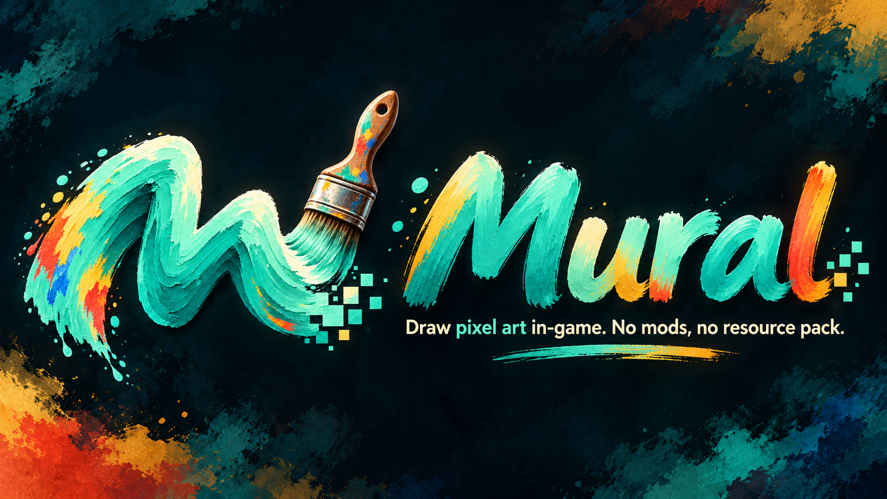
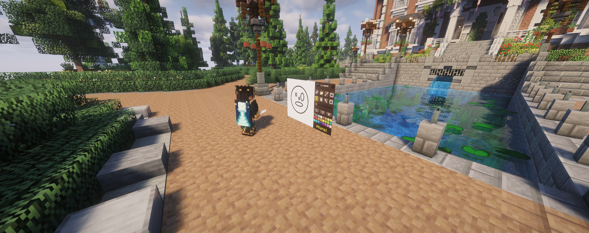
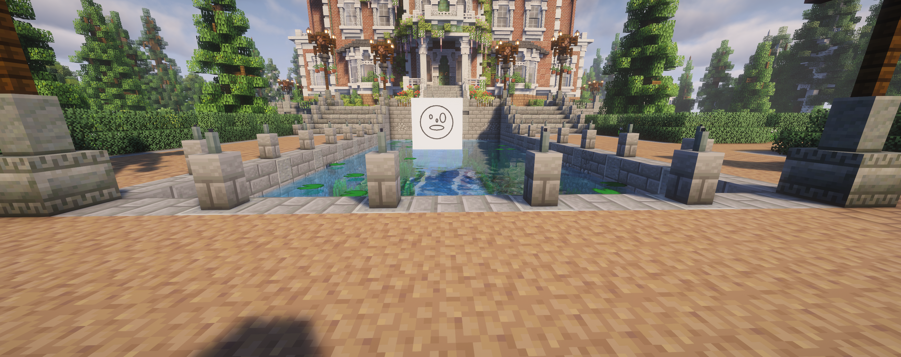
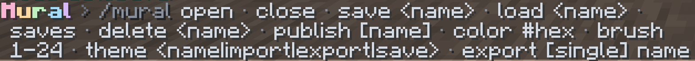
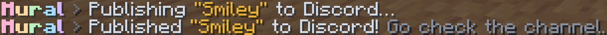
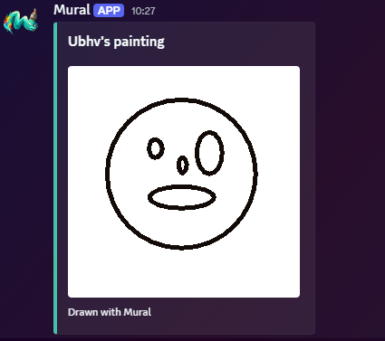
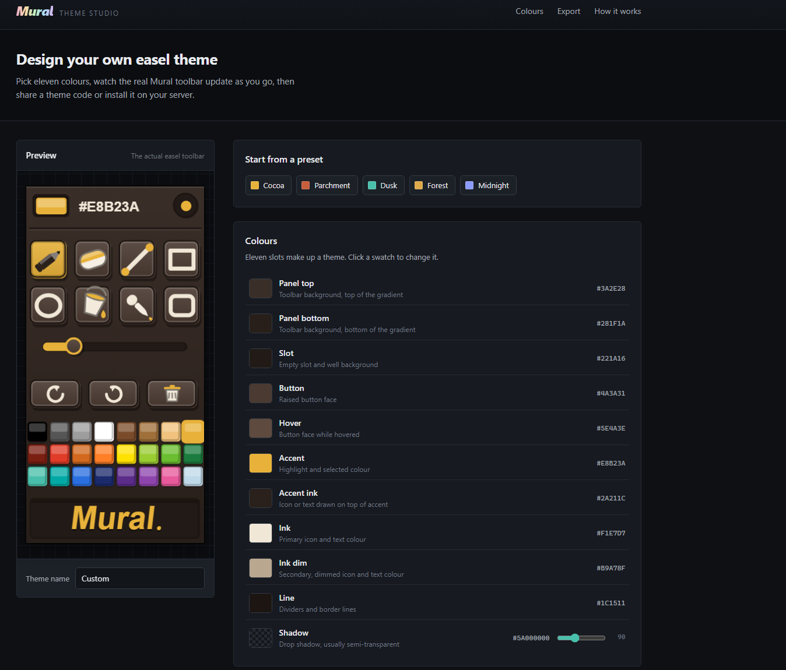
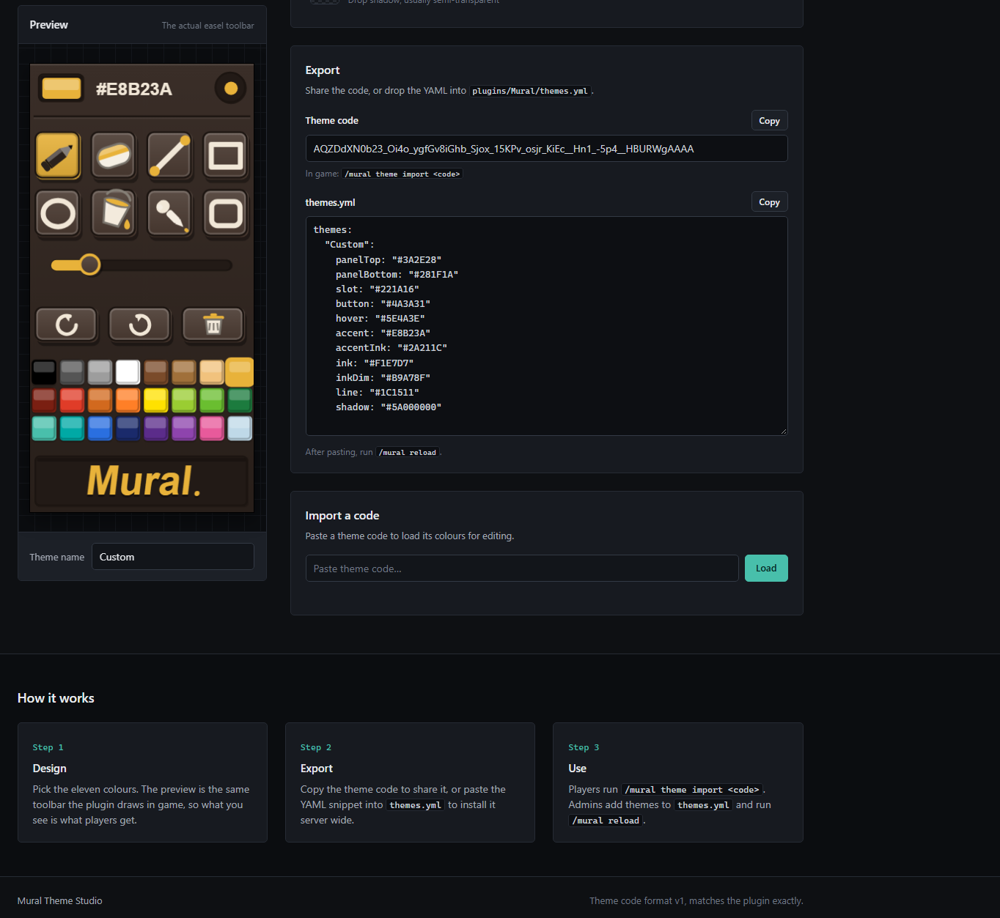

<p align="center">
  
</p>

<h1 align="center">Mural</h1>

<p align="center">
  <b>Draw pixel art in-game with your crosshair, then hang it on the wall or share it.</b><br>
  No mods. No resource pack. No client-side install.
</p>

<p align="center">
  
  
  
</p>

---

## What is Mural?

Mural turns a simple easel into a full drawing canvas. Players open an easel, aim with their
crosshair, and paint directly onto in-game maps using a floating toolbar of real drawing tools.
When a piece is finished they can hang it on a wall as a map item, save it to a slot to keep editing
later, or publish it straight to a Discord channel.

Everything runs server side. There is nothing to install for players: no resource pack, no client mod,
and it works for Java and Bedrock (Geyser) players alike.

<p align="center">
  
</p>

## Features

- **Crosshair drawing** straight onto in-game maps, fully server side.
- **A real toolbar** with pen, eraser, line, rectangle, ellipse, fill (bucket) and eyedropper tools.
- **Full color control**: a color palette plus direct hex input, and adjustable brush size from 1 to 24.
- **Undo, redo and clear** while you work.
- **Multiple easel sizes** so you can paint small signs or large murals.
- **Save slots**: keep your work in progress, load it back, list your saves and delete old ones.
- **Export to hangable maps** that survive server restarts.
- **Discord publishing** through a webhook, with an optional rich embed.
- **Custom themes** for the toolbar, with shareable theme codes and an online Theme Studio.
- **Flexible storage**: SQLite by default, or H2 and MySQL.
- **No resource pack and no client mod required.**

## Gallery

<p align="center">
  
</p>

## Commands

All commands are used through `/mural`.

<p align="center">
  
</p>

| Command | Description |
| --- | --- |
| `/mural open [1-3]` | Open a drawing easel (optional size). |
| `/mural close` | Close the editor. |
| `/mural save <name>` | Save the current canvas to a named slot. |
| `/mural load <name>` | Load a saved canvas. |
| `/mural saves` | List your saved canvases. |
| `/mural delete <name>` | Delete a saved canvas. |
| `/mural publish [name]` | Publish a painting to Discord. |
| `/mural color #hex` | Set the drawing color by hex value. |
| `/mural brush <1-24>` | Set the brush size. |
| `/mural theme <name\|import\|export\|save>` | Switch, import, export or save a toolbar theme. |
| `/mural tool [next\|name]` | Switch drawing tool. |
| `/mural undo` | Undo the last action. |
| `/mural export [single] <name>` | Export a painting to hangable map items. |
| `/mural license <key>` | Activate the plugin with your license key. |
| `/mural reload` | Reload the configuration (admin). |

## Permissions

| Permission | Description | Default |
| --- | --- | --- |
| `mural.command` | Use `/mural` and the in-session tools. | everyone |
| `mural.open` | Open a drawing easel. | everyone |
| `mural.save` | Save, load, list and delete canvases. | everyone |
| `mural.export` | Export paintings to hangable maps. | everyone |
| `mural.publish` | Publish paintings to Discord. | everyone |
| `mural.admin` | Reload the configuration. | operators |
| `mural.*` | Grants every Mural permission. | operators |

## Discord publishing

Create a webhook in your Discord channel (Edit Channel -> Integrations -> Webhooks), paste the URL
into `discord.webhook-url`, set `discord.enabled` to true, and players can share their art with
`/mural publish`. The post can be a clean rich embed or a plain caption.

<table>
  <tr>
    <td align="center"><br><sub>Publishing from in game</sub></td>
    <td align="center"><br><sub>The result in Discord</sub></td>
  </tr>
</table>

## Custom themes

The toolbar look is fully themeable. Players and admins can switch between built-in themes, or design
their own in the online **Theme Studio**, then share it as a compact theme code that anyone can import
in game with `/mural theme import <code>`.

<table>
  <tr>
    <td align="center"><br><sub>Design a theme with a live preview</sub></td>
    <td align="center"><br><sub>Export and share it as a theme code</sub></td>
  </tr>
</table>

## Requirements

- A Paper or Spigot server on Minecraft **1.21** or newer.
- Java 21 or newer.
- Folia is not supported.
- Bedrock players are supported through Geyser.

## Installation

1. Download `Mural.jar`.
2. Drop it into your server's `plugins/` folder.
3. Start the server once to generate the configuration.
4. Open `plugins/Mural/config.yml` and paste your license key into `license.key`.
5. Restart the server, or run `/mural license <key>` in game or from the console.

That's it. The plugin downloads its own database drivers on first start, so nothing else is needed.

## Configuration

The generated `config.yml` covers the license key, editor behaviour and anti-spam limits, storage
backend and Discord publishing. A few highlights:

```yaml
editor:
  # Auto-close an easel when a player walks this many blocks away (0 = never).
  max-distance: 24
  # Cooldown between exports, in seconds.
  export-cooldown-seconds: 10
  # Max named save-slots per player (0 = unlimited).
  max-saves: 30

storage:
  # sqlite (default) | h2 | mysql
  type: sqlite

discord:
  enabled: false
  webhook-url: ""
```

### Storage backends

Exported maps and save slots are persisted so art survives a restart. Choose the backend that fits
your setup:

- **SQLite** (default): zero setup, stored in a file inside the plugin folder.
- **H2**: file based alternative.
- **MySQL**: for shared or networked setups. Point it at an existing database and Mural creates its
  tables automatically.

## License

Mural is a premium plugin protected by a license system. Each server activates with its own key.
Redistribution of the plugin or its license keys is not allowed.

## Acknowledgements

Mural is based on the original **Daub** project and is developed and sold with the kind permission of
its original owner. Big thanks for allowing this to grow into something new.

## Support

Found a bug or have a feature request? Open an issue or reach out through the support channel listed
on the store page.
